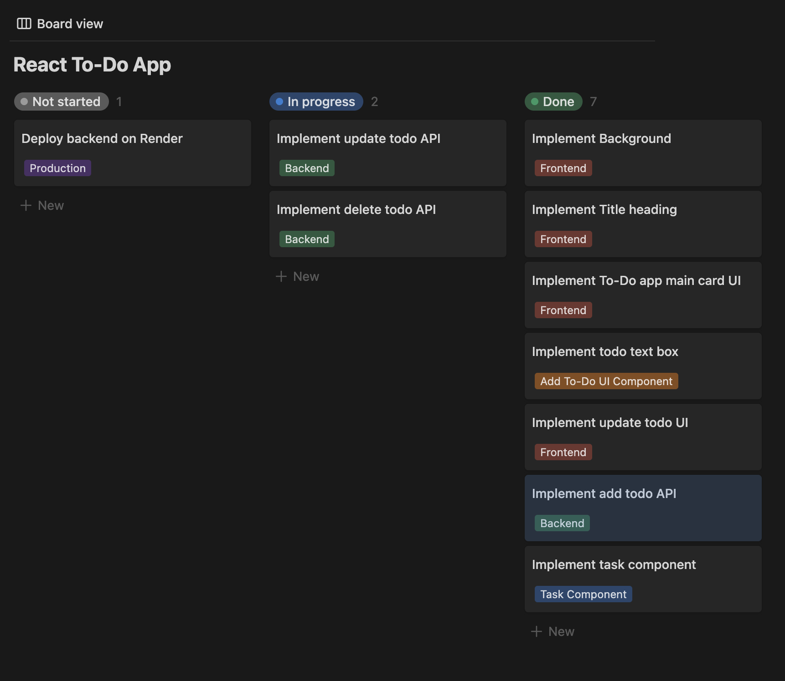

<h2 align="center">
  To-Do App 
  <a href="https://todo-app-rob8.onrender.com/" target="_blank">https://todo-app-rob8.onrender.com/</a>
</h2>

  

 

## About The Project

  

#### Duration
- April - May 2024

#### Key Skills
- UI/UX, Web Design
- Full Stack Web Development

 

A full stack to-do list web app, for managing and completing tasks.

## Built With

This full-stack project was built using these technologies:
- React.js 
- Tailwind CSS
- Express
- Node.js
- MongoDB
- VS Code
- Figma

## Features

**✅ Add, complete and delete tasks**

**🎨 Styled with Tailwind CSS**

## Design Process

### Wireframes

These wireframes were designed from scratch in Figma, with just high fidelity wireframes in mind. The wireframes were designed with simplicity in mind, with the core focus on functionality over design. In addition, the wireframes loosely show a user flow; for adding to-dos, deleting to-dos, completing to-dos and updating a to-do name.

#### Main Menu

    

#### Add Task Flow

    

#### Delete Task Flow

    

#### Edit Task Flow

    

## Reflection
### What I’ve Learned
This was my first time designing a full-stack application from scratch. I had to research the colour pallettes and fonts first. Then proceed to create the individual elements, such as buttons and text forms. And it was also my first time utilising the Figma component feature. So I was able to use this for the individual task component, and was able to reuse my designs with ease. As a result, I settled on a sleek and simple design for my to-do app, which I was confident in implementing from scratch - with the little experience I have in web design.

### Problems Encountered
During the design process, I definitely struggled with whitespacing. I seldom knew how much or how little I should give between each element. Therefore, I just had to rely on my instinct to determine if the design looked good or not. A way I could avoid this is to read documentation on modern web app design or maybe take a short online course on UX/UI design. So I have a strong foundation to work with. Additionally, I could have just asked a friend for a second opinion on how I could have improved this design. But since, I was the primary user of this web app. I did not think that this was necessary.

### Future Directions
In the future, I could have taken some time to map out the userflow and draw low fidelity wireframes instead of jumping straight into a high fidelity wireframe. So that I could understand how the user would interact with this system through and through and then base my final design around the userflow.

## Development Process

#### Key Skills
- Front-End Development
- Back-End Development
- Database Management

For the most part, I would argue that the development process was very smooth as having the Figma designs beforehand helped a lot with visualising how I want the web app to look like and how users would interact with it. Therefore, I would say that my first attempt in bulding a full-stack application from scratch was very successful.

### Kanban Board

### What I’ve Learned

From previous project, I had somewhat of a grasp of front-end development. But this was the project, for me, which cemented my understanding of React components, useEffect and useState hooks. Which I've used to get the todos from the database, and pass the data through the intended compenents. 

In addition, I've also learned about axios and cors, which I used to connect the back-end to the front-end and vice versa. And I've also learned how to use .env files to configure ports and my MongoDB database, so that I am able to deploy my full-stack application to Render.

### Problems Encountered

The biggest problem I encountered was definitely the setup process. I had to set up tailwind css and configure themes and colour pallettes within the tailwind config file. Also, having to install the different libraries such as axios and cors were very confusing at first. 

Additionally, having to run the 'build' script in my front end and copy the dist directory to my backend was a first for me, as I had to do that every time I made changes to the front-end - in order for the front-end to display on Render. 

So overall, just the fact that there's so much setup compared to the actual coding part was very challenging to me and I actually found it quite annoying. But I managed to figure it out thankfully.

### Future Directions

Going further, I would definitely try and implement the update to-do task name in the future. It was a core part of my early design that I didn't have the courage to execute. So if I were to revisit this project again in the future, that would be a main feature for me I would prioritise implementing.

Another feature I would implement would probably be a user login system and user authentication. So that individual users would be able to add and manage their own tasks, and have it so their tasks would only be shared with them and them only, no one else.

### Final Words
All in all, I was very happy with how my project turned out. During this whole process I was battling with my perfectionist tendencies and I would periodically remind myself that finishing a project, in its barebones, is more important than making a project look like what I had imaginied in my head. It was small hurdle looking back, but it was what I needed to get over, so that I could move on and improve as a programmer and designer.

## Credits

Joe Groves

