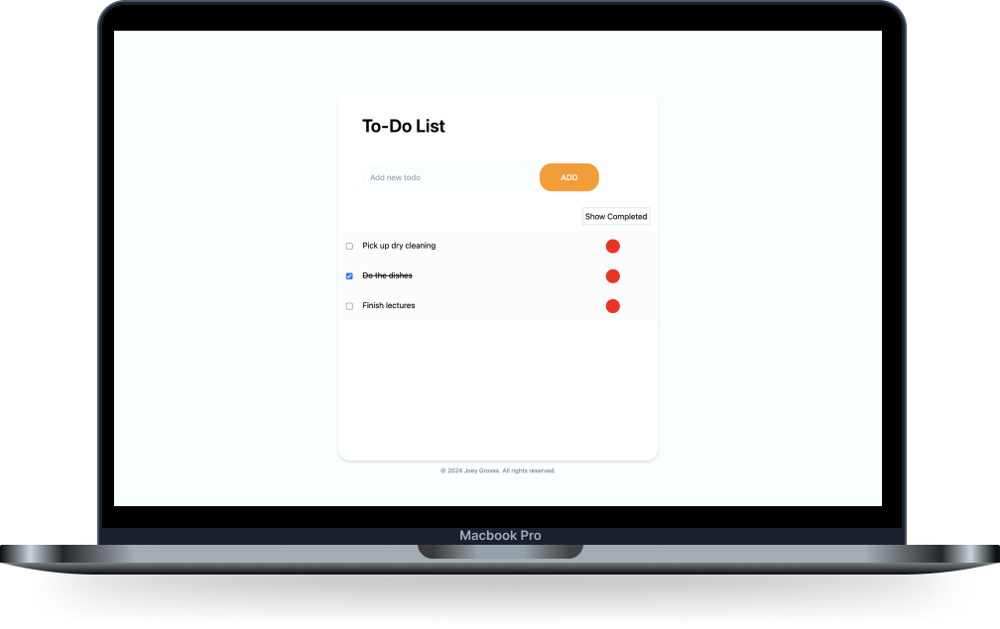
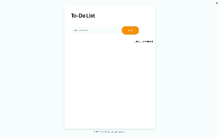
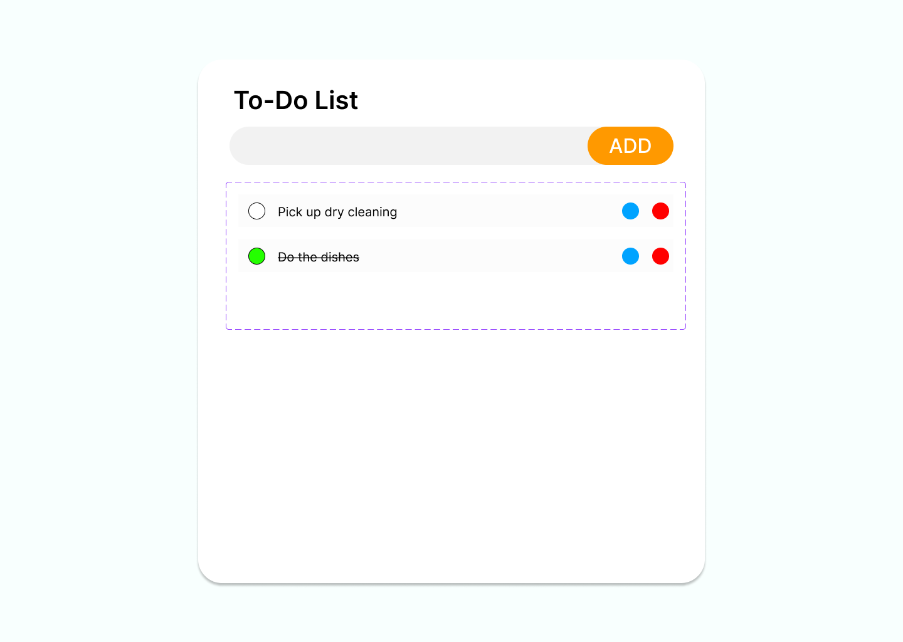
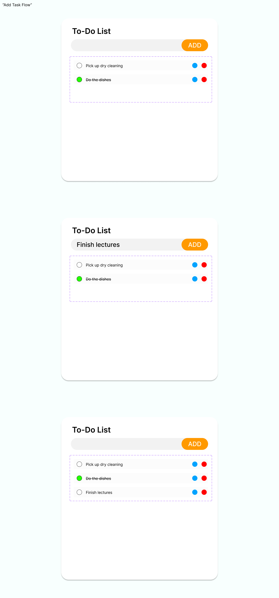
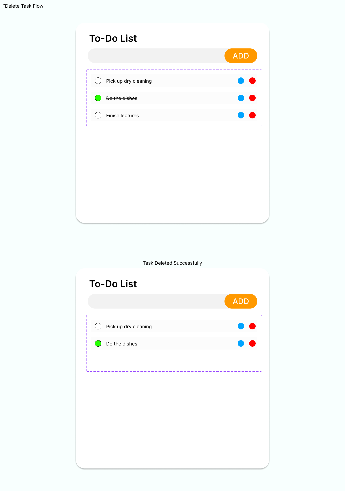
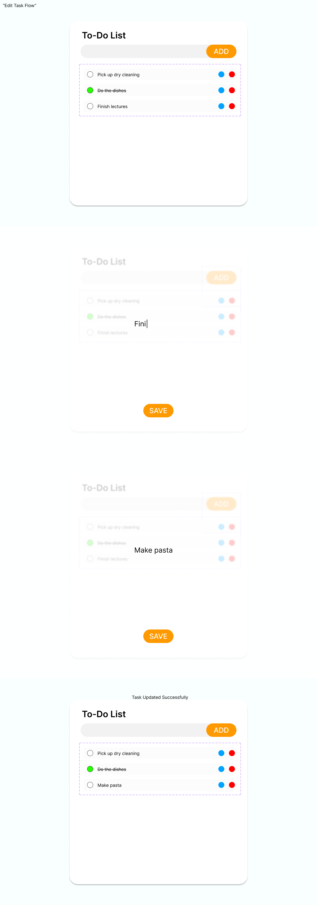

<h2 align="center">
  To-Do App 
  <a href="https://todo-app-rob8.onrender.com/" target="_blank">https://todo-app-rob8.onrender.com/</a>
</h2>

  

 

## About The Project

  

#### Duration
- April - May 2024

#### Key Skills
- UI/UX, Web Design
- Full Stack Web Development

 

A full stack to-do list web app, for managing and completing tasks.

## Built With

This full-stack project was built using these technologies:
- React.js 
- Tailwind CSS
- Express
- Node.js
- MongoDB
- VS Code
- Figma

## Features

**✅ Add, complete and delete tasks**

**🎨 Styled with Tailwind CSS**

## Design Process

### Wireframes

#### Main Menu

    

#### Add Task Flow

    

#### Delete Task Flow

    

#### Edit Task Flow

    

## Reflection
### What I’ve Learned
TBA

### Problems Encountered
TBA

### Future Directions
TBA

## Development Process

#### Key Skills
- Front-End Development
- Back-End Development
- Database Managment

The development process was smooth, for the most part - but took way longer than expected. I had a clear vision of what the end-product should look like- and its functionality. But I procrastinated in starting the actual coding of the website, as I felt a little overwhelemed with the amount of features I had to implement. Therefore, using a Kanban Board, via Jira Software, definitely helped with breaking massive tasks into smaller and manageable pieces,that I was able to easily implement. Moving stories from one section of the board to another, felt very satisfying and helped keep track of the development process.   

### Kanban Board

### What I’ve Learned

Using React.js made sense for this single-page website. I also put an emphasis on organisation, so my hooks were under one directory, my components where under a separate directory, etc.. In turn, I've learned and applied React programming best practices during the development of this project.  

This was my first time using Framer Motion and React Smooth Scrolling. In my opinion, this enhanced the user experience of interacting with the website, and as a developer it was very easy to add animations and smooth scroll. Like Tailwind CSS, I will continue to use this in future projects involving any portfolios and beyond.   

### Problems Encountered

This was my second experience building a project with Tailwind CSS and my (lack of) experience shows. It was tough to set up Tailwind at the start, after creating the react app. But it was definitely worth it, as I was able to debug styling bugs much easier, compared to if all styles where under one singular CSS file; and I was able to easily create responsive CSS styles.  

However, there two main issues that I have yet to resolve. One of them being in the 'Affiliates' page, when the website is in tablet or mobile view, the grid pop-up information's text seems to overflow out of the box it was supposed to be contained under. And I haven't figured out how to solve this.  

The other issue is the footer. It was supposed to have the social media icons component (as seen in the wireframes), that was used in the home/landing page, in the footer itself. Since I created this component for the intention of re-use within the project. It made sense for me to just add the component into the footer and leave it at that. However, when I did such thing, the component was too large for the footer and it would create problems in the positioning of the other elements.  

### Future Directions

Other than fixing the styling issues, I would improve on two other aspects of this current iteration of the website:

- Contact Form: I could add a back-end to this project and handle user form data myself instead of using 'React Hook Form'.
- Testimonial Carousel: Either change the styling of the component and make it match the intended design based on the wireframes. Or I could design and implement the testimonial carousel myself, from scratch.

## Credits

Joe Groves

